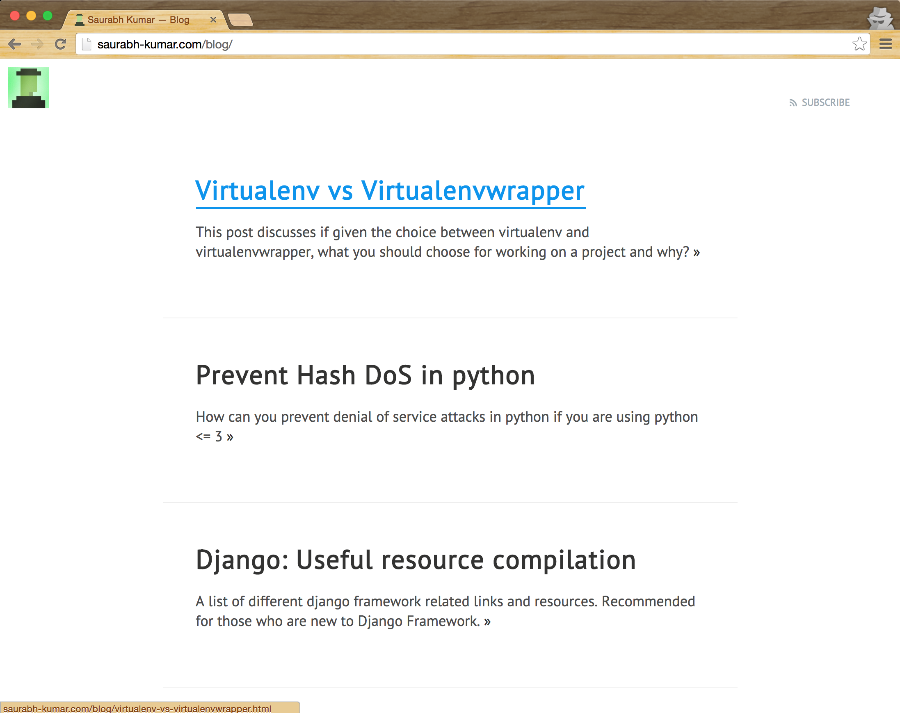

# SVTLE RESPONSIVE THEME

pelican-svbtle-responsive is a responsive theme for [Pelican](http://getpelican.com), it is my hack of a svbtle-like theme.

## Demo

You can see the [theme in action](http://saurabh-kumar.com/blog/).

## Features

- Clean and responsive design
- [Disqus](https://disqus.com/) Comments
- Customizable Syntax highlighting via [pygments][pygments]
- Google analytics
- Twitter [cards][twitter-cards]
- semantic tags for google, facebook and twitter
- Responsive Videos using [fitvids][fitvids]

[pygments]: http://pygments.org/
[twitter-cards]: https://dev.twitter.com/cards/overview
[fitvids]: http://fitvidsjs.com/

## Installation

Clone the [repository](https://github.com/theskumar/pelican-svbtle-responsive), edit your `pelicanconf.py` and modify the `THEME` variable to make it point to the downloaded theme location.

### Configurations

The following global variables can be added to you `pelicanconf.py` for use different features of this theme. See sample configuration [here](https://github.com/theskumar/blog/blob/master/pelicanconf.py) and [here](https://github.com/theskumar/blog/blob/master/publishconf.py).

- `GOOGLE_ANALYTICS` your UA-XYZ code

- `TWITTER_USERNAME` your twitter username (optional)

- `GOOGLE_PLUS_PROFILE_URL` your google plus profile url (optional)

- `USER_LOGO_URL` you don't need to replace the logo placeholder, instead put your logo in content/images/your_logo.png and make this point to `SITEURL + '/static/images/your_logo.png'`

- `DISQUS_SITENAME` set this to enable disqus comments in articles

- `TAGLINE` some text rendered right below the logo

- `INTERNET_DEFENSE_LEAGUE` set this to `True` if you want to enable the [Internet Defense League](http://internetdefenseleague.org) code

- `COPY_TEXT_PLUS` set this to `True` if you want to add `Read More at page-url` when a text from the blog article is copied by someone.

## Development

    npm install
    gulp

A different Pygmentize theme can be used by editing `./Makefile` and running `make pygments`.

## Author

pelican-svbtle-responsive is authored by Saurabh Kumar ([@_theskumar](http://saurabh-kumar.com))

## License

MIT
